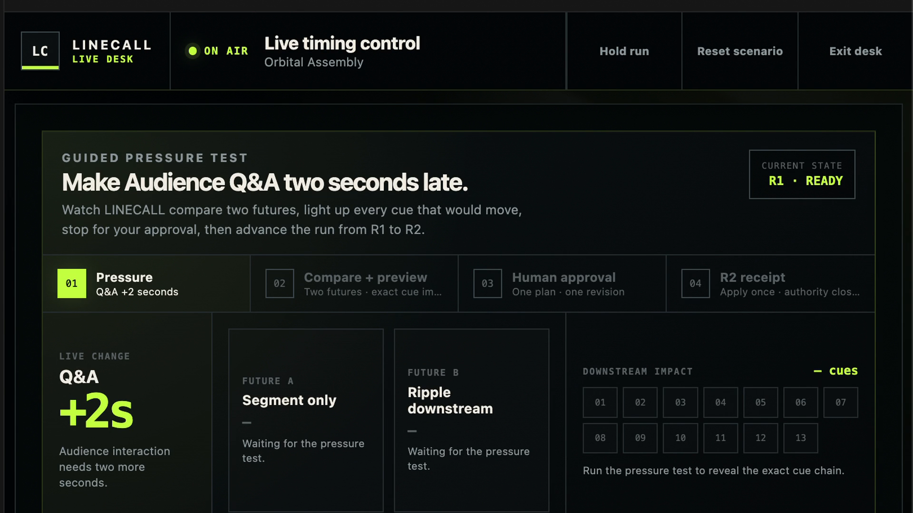
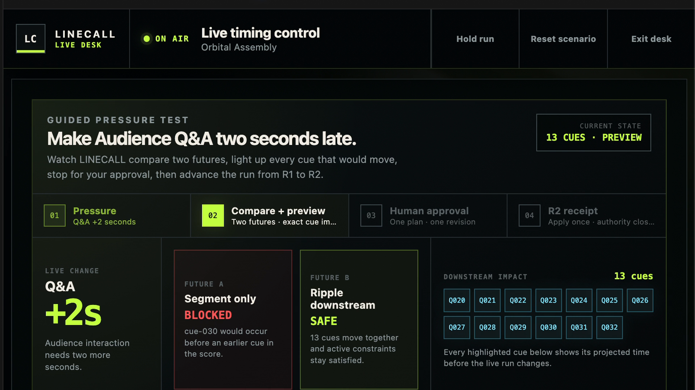
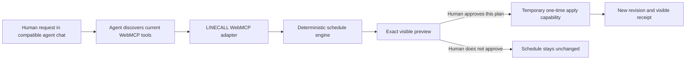
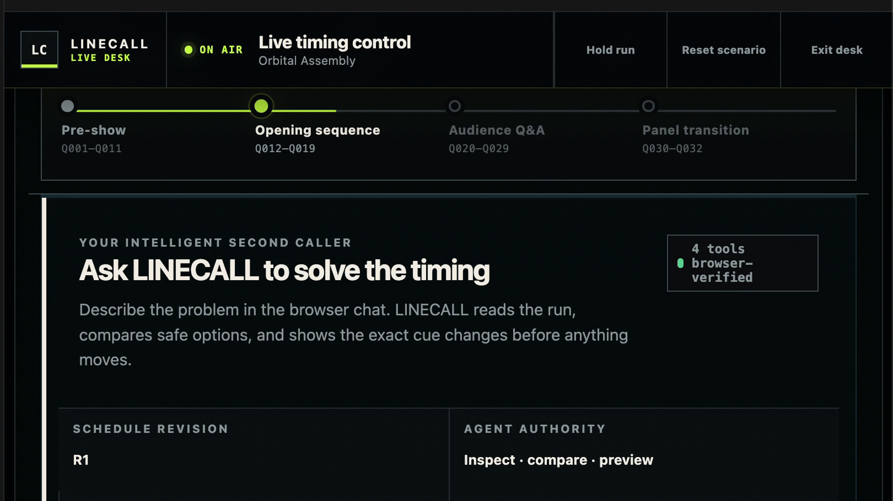
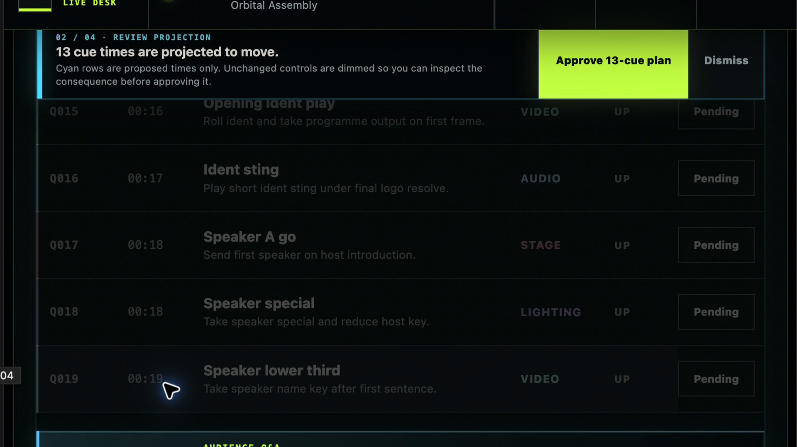
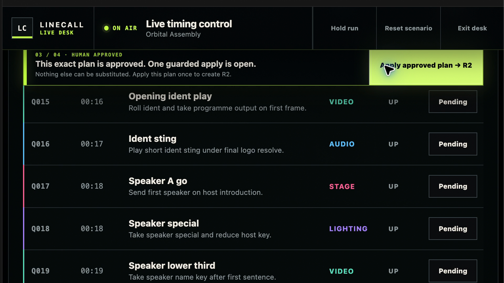
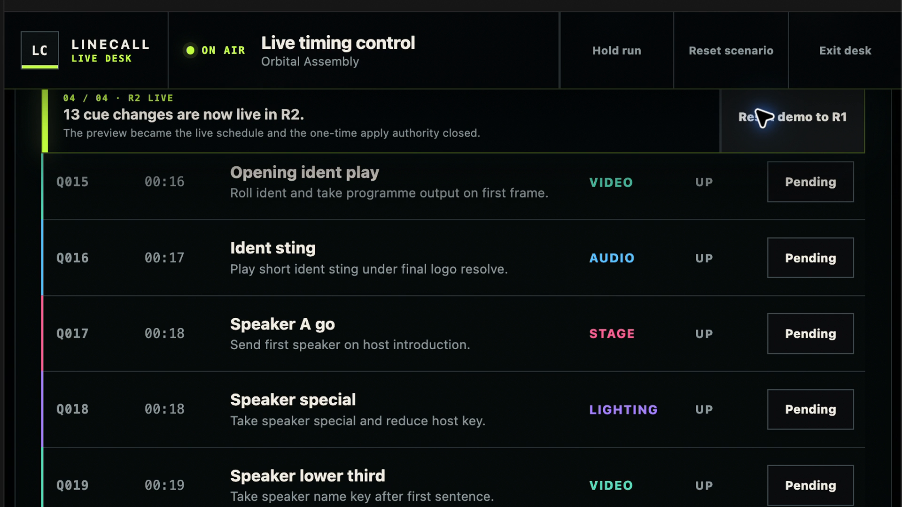
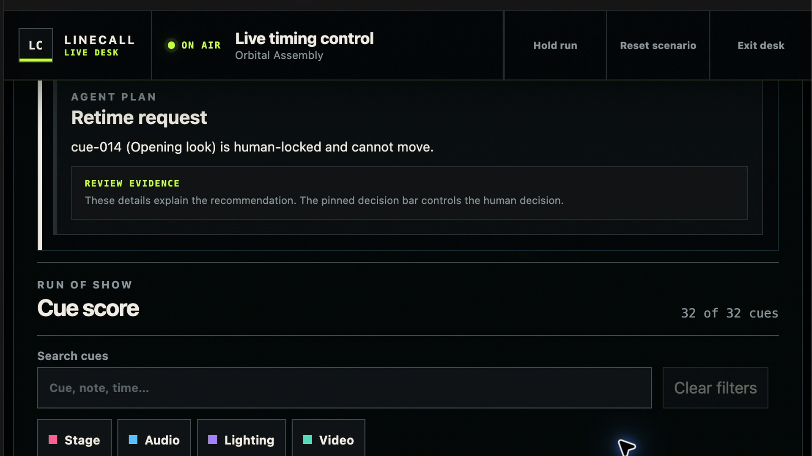

<h1 align="center">LINECALL</h1>

<p align="center"><strong>Live timing control where agents can explore the run, deterministic rules decide what is safe, and people keep final authority.</strong></p>

<p align="center">
  <a href="https://grassy-lotus-7dr8.here.now/demo"></a>
  <a href="#verification"></a>
  <a href="./LICENSE"></a>
</p>



LINECALL is a WebMCP-powered run-of-show application for live events. It gives an AI agent a small, purpose-built set of tools for reading a production schedule, comparing timing strategies, preparing exact cue changes, and updating low-risk readiness state. It does **not** give the agent broad control of the page.

The central idea is simple:

> **The agent explores. The schedule engine verifies. The human approves. The agent acts once.**

Built for the **2026 OpenAI WebMCP Challenge**.

## Try it

- **Live product:** [grassy-lotus-7dr8.here.now](https://grassy-lotus-7dr8.here.now/)
- **Guided challenge demo:** [grassy-lotus-7dr8.here.now/demo](https://grassy-lotus-7dr8.here.now/demo)
- **Public source:** [github.com/makiaveli1/sitecraft-linecall](https://github.com/makiaveli1/sitecraft-linecall)

The normal website works as a human-operated run-of-show interface in an ordinary modern browser. The agent features require a browser or agent host that supports WebMCP.

## Watch the complete demo

[](./docs/media/linecall-webmcp-challenge-demo.mp4?raw=1)

**[▶ Watch or download the 2:32 MP4 demo](./docs/media/linecall-webmcp-challenge-demo.mp4?raw=1)** — 1920×1080, H.264 video with narrated audio.

The recording shows the complete R1 → R2 workflow: browser tool discovery, safe-versus-blocked comparison, exact preview, human approval, one-time execution, visible receipt, and a separate human-lock refusal.

## The problem LINECALL solves

A last-minute timing change in a live show is rarely local. Moving one cue may affect speakers, video, lighting, audio, downstream segments, or a fixed hard-out. A general-purpose agent clicking around a dense control screen would have to guess what each control means and could easily act with too much authority.

LINECALL separates the work into three clear roles:

| Role | Responsibility |
| --- | --- |
| **AI agent** | Read the run, compare alternatives, prepare an exact plan, explain blockers, and update low-risk readiness state |
| **Deterministic schedule engine** | Enforce chronology, spacing, hard-out, current revision, exact plan identity, and human locks |
| **Human operator** | Own cue locks and approve the exact timing plan before the live schedule can change |

This removes two bad trade-offs: the operator does not have to calculate every downstream consequence by hand, and the agent does not receive broad permission to control a safety-sensitive interface.

## How the browser chat actually works

LINECALL does **not** contain its own chat box. In the recorded demo, the conversation happens in the surrounding ChatGPT/Codex chat while LINECALL is open in a WebMCP-capable in-app browser.

In simple terms:

1. The person asks for a result in the agent's chat.
2. The compatible browser tells the agent which LINECALL tools are currently available on the open page.
3. The agent calls those tools with structured inputs instead of clicking buttons or reading the page layout.
4. LINECALL's deterministic schedule engine checks the request.
5. If timing would change, LINECALL shows the exact result to the human and stops.
6. Human approval temporarily exposes one exact apply tool.
7. The agent can use that authority once; LINECALL then removes it and records a receipt.

So, this is **not every ordinary ChatGPT browser tab automatically controlling LINECALL**. It is any agent and browser host that implements the WebMCP connection and has the LINECALL page open. In a browser without WebMCP, the human interface still works, but the agent cannot discover or call LINECALL's page tools.



## The challenge story, step by step

### 1. Start at a known revision

The guided pressure test begins at schedule revision **R1**. The operator asks to make Audience Q&A two seconds later.


### 2. Discover only the capabilities that are currently allowed

Before approval, the browser verifies four active tools. The schedule-changing apply tool is absent.



### 3. Compare two futures before choosing one

The agent compares a segment-only move with a downstream ripple. LINECALL's schedule engine rejects the first because it breaks chronology. The ripple is safe and identifies all 13 cues that would move.


### 4. Show the exact consequence and stop for the person

The proposed cue times are only a preview. The live schedule is unchanged, unrelated controls are dimmed, and the operator can inspect the whole 13-cue plan.



### 5. Turn human approval into narrow, temporary authority

Approval is bound to one deterministic plan ID at one schedule revision. Only then does the fifth WebMCP tool — `linecall_apply_approved_retime` — become available.



### 6. Apply once, advance the revision, and leave evidence

The agent applies that exact plan. LINECALL advances from R1 to **R2**, shows a visible 13-cue receipt, and removes the temporary apply capability. The active tool count returns from five to four.



### 7. Refuse a request that crosses a human boundary

A second test asks to move the Opening sequence. Cue Q014 is human-locked, so the plan is blocked. There is deliberately no WebMCP tool that lets the agent remove the lock.



## Why this is genuinely WebMCP

LINECALL is not using an agent to imitate mouse clicks. The page exposes domain concepts directly through `document.modelContext.registerTool`:

| Tool | What it lets the agent do | Browser availability | State change |
| --- | --- | --- | --- |
| `linecall_get_run_snapshot` | Read the current run, revision, locks, readiness, and constraints | Normal session | None |
| `linecall_compare_retime_options` | Compare `segment_only` and `ripple_after` strategies | Normal session | None |
| `linecall_preview_segment_retime` | Prepare and visibly stage exact cue-level changes | Normal session | Preview only |
| `linecall_set_cue_readiness` | Set a cue to pending, ready, or check | Normal session | Low-risk readiness |
| `linecall_apply_approved_retime` | Apply the exact approved plan at the expected revision | **Only during active human approval** | Live schedule |

The tool definitions use strict JSON schemas, explicit revision preconditions, and WebMCP annotations. Operator-authored schedule data is marked as untrusted content when it can be returned to an agent.

### The capability lifecycle is part of the product

```text
R1, no approval       4 tools  inspect · compare · preview · readiness
Human approves       5 tools  the exact one-time apply capability appears
Plan is used/invalid  4 tools  apply disappears; replay is impossible
```

That **4 → 5 → 4** change matters. Approval is not only a modal or a message saying “allowed.” It changes what the browser exposes to the agent.

## Safety and authority model

| Guardrail | What it prevents |
| --- | --- |
| **Preview before mutation** | A timing request cannot silently change the live run |
| **Revision binding** | A plan prepared at R1 cannot be applied to a different schedule state |
| **Exact deterministic plan ID** | Approval cannot be reused for a substituted plan |
| **Human-owned cue locks** | The agent cannot move protected cues or grant itself unlock authority |
| **Chronology and spacing checks** | Cues cannot be reordered into an invalid run |
| **Hard-out enforcement** | A safe-looking change cannot push the show beyond its fixed end |
| **One-time apply capability** | An approved plan cannot be replayed after use or invalidation |
| **Visible receipt** | The operator can see what changed, at which revision, and why |

The language model helps reason about alternatives. The deterministic engine — not the model — decides whether the exact cue changes satisfy the production rules.

## Judge path

Open the [guided demo](https://grassy-lotus-7dr8.here.now/demo) in a compatible WebMCP browser and use this primary request:

> The audience Q&A needs to start two seconds later. Find the safest way to absorb that delay without breaking the run, and show me the exact change before anything moves.

Expected result:

1. Read R1.
2. Compare `segment_only` and `ripple_after`.
3. Reject segment-only because it breaks chronology.
4. Stage the safe 13-cue ripple plan.
5. Stop at the human boundary.
6. Human approves the exact plan.
7. Browser capabilities change from 4 → 5.
8. Agent applies the approved plan once.
9. LINECALL advances to R2, leaves a receipt, and returns to four tools.

Then use the trust request:

> Move the Opening sequence two seconds later.

Expected result: both strategies are blocked because Q014 is human-locked, and no unlock tool is available.

For a negative selection check, ask:

> What is the weather tomorrow?

Expected result: the agent should not select a LINECALL tool.

## Challenge criteria

| Criterion | Evidence in LINECALL |
| --- | --- |
| **WebMCP leverage** | Structured domain tools replace DOM guessing; browser-visible authority changes with human state; strict schemas and revisions make calls explicit |
| **Execution** | A complete React/Vite product, responsive operator workspace, permanent HTTPS deployment, real-browser rehearsal, and 30/30 passing tests |
| **Potential impact** | Reduces manual downstream timing calculation for conferences, theatre, broadcast, streams, awards shows, and other cue-driven work while preserving operator authority |
| **Creativity and ambition** | Human approval becomes temporary capability; deterministic constraints and agent reasoning remain separate; the demo proves both success and refusal paths |

## Verification

The current challenge release has passed the registered PC Bridge verification workflow with:

- **30 passed / 0 failed / 0 skipped** tests;
- a production Vite build;
- a real Chromium production-build rendering and interaction test;
- deterministic schedule-safety tests;
- WebMCP contract, registration, discovery, and runtime tests;
- agent tool-selection and call-order evals; and
- exact-state verification, meaning the project did not change during the verification run.

Attended checks on the permanent HTTPS origin confirmed:

- four normal-session tools discovered through the browser;
- snapshot → compare → exact 13-cue preview;
- exact human approval of `retime-r1-qa-p2-ripple_after`;
- the temporary fifth apply capability;
- one exact apply at R1;
- R2 with Q020 at `00:24`, Q032 at `00:47`, and a visible receipt;
- return to four tools with no active approval or conflicts; and
- refusal to retime the locked Opening sequence.

On 2026-09-02, all seven declared cases in [`evals/webmcp-agent-cases.json`](./evals/webmcp-agent-cases.json) were replayed against the deployed `/demo` and matched their expected tool calls and arguments, including no LINECALL call for the unrelated weather request.

## Run locally

Requirements: a current Node.js installation and npm.

```bash
npm ci
npm run dev
```

Vite prints the local URL. Open that URL for the normal site, or add `/demo` for the guided pressure test.

Build the production bundle:

```bash
npm run build
```

Run the complete test suite:

```bash
npm test
```

For native local WebMCP inspection, use a compatible browser environment. The challenge path was verified in ChatGPT's WebMCP-capable in-app browser. Chrome testing can use a WebMCP-enabled build and its Model Context Tool Inspector.

No OpenAI API key is required for the core application. WebMCP is the browser-level contract between LINECALL and a compatible agent.

## Project structure

```text
.
├── docs/media/             # README screenshots and narrated challenge video
├── evals/                  # agent tool-selection and ordering cases
├── public/                 # static product artwork
├── src/
│   ├── App.jsx             # operator UI and human/agent collaboration surface
│   ├── schedule.js         # deterministic timing and constraint engine
│   ├── state.js            # revisions, approvals, locks, readiness, receipts
│   └── webmcp.js           # WebMCP schemas, handlers, and registration
├── tests/                  # schedule, WebMCP, eval, and Chromium evidence tests
├── CHALLENGE.md            # dated challenge work and provenance ledger
├── SUBMISSION.md           # submission narrative and judge path
├── LICENSE                 # MIT
├── package.json
└── vite.config.js
```

## Technology

- React 19
- Vite 8
- modern CSS
- WebMCP Imperative API
- Node's built-in test runner
- Chrome DevTools Protocol for browser evidence

## Challenge provenance

LINECALL existed before the WebMCP Challenge as a React run-of-show interface. The challenge copy was created on **2026-08-27** from the pre-existing public project `makiaveli1/sitecraft-linecall`.

Challenge work added the semantic WebMCP tool surface, deterministic retiming engine, schedule revisions, human locks, exact-plan approval, temporary apply authority, receipts, browser discovery proof, agent evals, and WebMCP-specific tests.

See [`CHALLENGE.md`](./CHALLENGE.md) for the detailed dated ledger and the explicit boundary between pre-existing work and challenge work. See [`SUBMISSION.md`](./SUBMISSION.md) for the full judging narrative and native proof procedure.

## Media integrity

All seven screenshots and the narrated demo are stored in this repository under [`docs/media`](./docs/media), so the README does not rely on a private image host. The final MP4 is 2:32, 1920×1080, H.264/AAC, with SHA-256:

```text
b638ae7bb6aefa00ba56f26efdd0136eeab79bc3256463baa3176562d8bda0e5
```

## License

Released under the [MIT License](./LICENSE).

---

<p align="center"><strong>LINECALL</strong> — give the agent enough context to help, enough structure to be safe, and no more authority than the person approved.</p>
